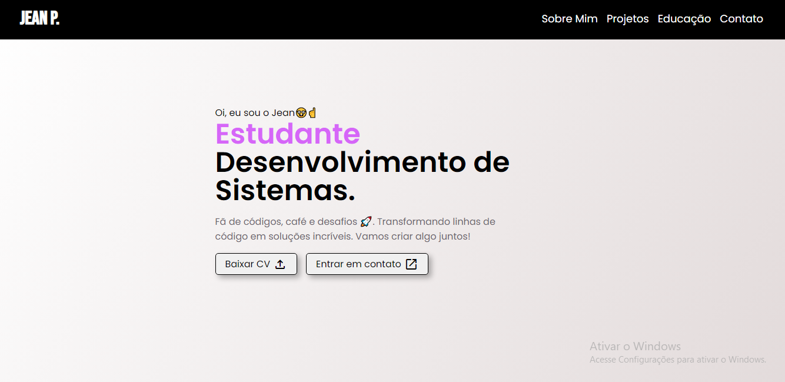

**🚀 Portfólio Pessoal de Jean 🌟**

Bem-vindo ao meu incrível portfólio! Aqui você encontrará uma visão abrangente dos meus projetos, habilidades e experiências. 🌈

### 🏠 [Início](#)


---

### 📱 Menu Mobile
- Responsável por tornar a navegação em dispositivos móveis intuitiva e amigável.
- [Código do Menu Mobile](https://github.com/Jeanaraga/Jean-Portfolio/blob/main/assets/js/menu-mobile.js)

### 🖥️ Menu de Projetos
- Apresenta meus principais projetos com informações detalhadas.
- [Código do Menu de Projetos](https://github.com/Jeanaraga/Jean-Portfolio/blob/main/assets/js/menu-projeto.js)

### 🖌️ Estilo e Layout
- Utiliza Sass para uma folha de estilo mais eficiente e modular.
- [Código do Estilo e Layout](https://github.com/Jeanaraga/Jean-Portfolio/tree/main/assets/scss)

---

### 📝 **README.md do Projeto**

#### 🚀 **Sobre o Projeto**

Meu portfólio é um projeto pessoal que visa apresentar meus trabalhos e habilidades de forma atrativa. Utilizo HTML, CSS (Sass), e JavaScript para criar uma experiência envolvente.

#### ⚙️ **Funcionalidades Principais**

1. **Menu Mobile:** Navegação intuitiva para dispositivos móveis.
2. **Menu de Projetos:** Destaca projetos significativos com detalhes interativos.
3. **Estilo e Layout:** Utilização do Sass para uma estilização modular e eficiente.

#### 🌐 **Visualização Online**

Você pode conferir o portfólio online [aqui](https://jeanaraga.github.io/Jean-Portfolio/).

---

### 🛠️ **Instruções de Uso**

1. **Clone o Repositório:**
   ```bash
   git clone https://github.com/Jeanaraga/Jean-Portfolio/
   ```

2. **Abra o Projeto no Navegador:**
   - Abra o arquivo `index.html` no seu navegador favorito.

3. **Explore!**
   - Navegue pelos diferentes menus, projetos e seções para conhecer meu trabalho.

---

### 🌟 **Destaque para Recursos Técnicos**

#### 💅 **Sass e Modularidade**
- Utilização do Sass para estilização eficiente.
- Abordagem modular para fácil manutenção.

#### 📱 **Design Responsivo**
- Layout responsivo para uma experiência consistente em vários dispositivos.

#### ⚡ **JavaScript Interativo**
- JavaScript para interatividade nos menus e apresentação de projetos.

---

### 🤝 **Contribuição e Problemas**

- Contribuições são bem-vindas! Fique à vontade para abrir issues ou pull requests.

### 📞 **Contato**

- Para mais informações ou contato, [envie-me um e-mail](mailto:jeanjesuspedrobook@gmail.com).

---

### 🙏 **Agradecimentos**

Obrigado por visitar meu portfólio! Espero que tenha uma experiência incrível explorando meus projetos e habilidades. 🚀

**Feito com ❤️ e ☕ por Jeanaraga**